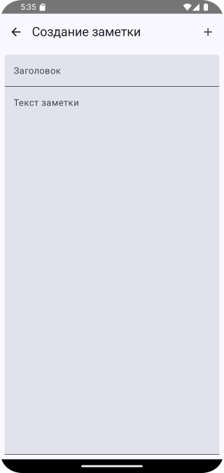
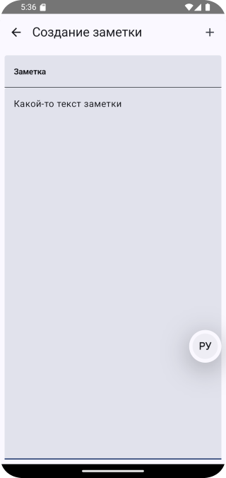
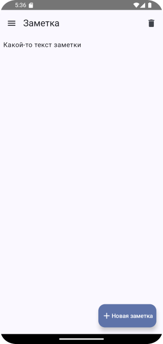
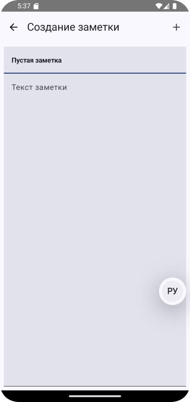
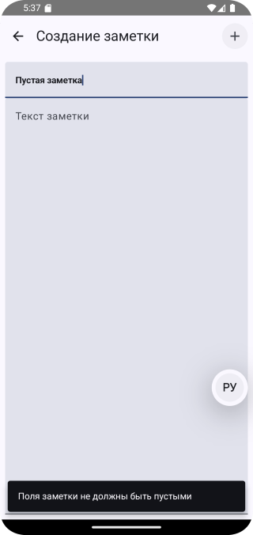
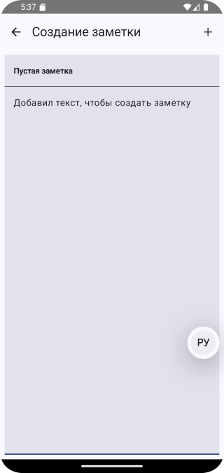
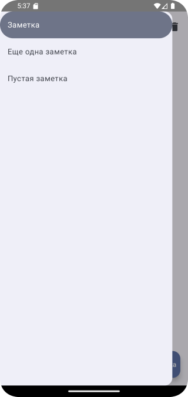
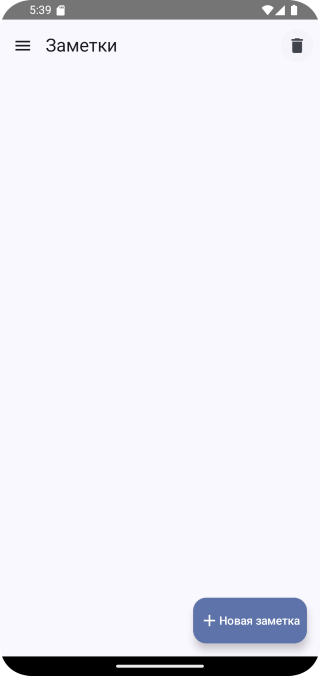
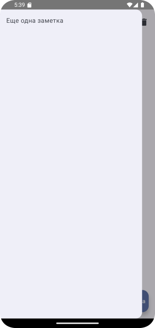

# Домашнее задание по теме "ModalDrawer"

## Приложение “Ежедневник/Заметки”

На основе пройденного материала необходимо написать приложение для написания и просмотра развернутых заметок, с возможностью их удаления. Приложение включает в себя два экрана: первый предназначен для просмотра и удаления заметок, второй - для их написания.

Первый экран включает в себя: `ModalNavigationDrawer`, для просмотра списка написанных заметок и переключения между ними по нажатию на `NavigationDrawerItem`. Каждый `NavigationDrawerItem` должен иметь `IconButton`, по нажатию на который, соответствующая заметка будет удаляться. Каждая заметка состоит из двух элементов: заголовка и основного содержания заметки. Заголовок отображается как на экране, в параметре content у `ModalNavigationDrawer`, так и в каждом `NavigationDrawerItem`. Основное содержание заметки отображается под заголовком в параметре content у `ModalNavigationDrawer`. Так же первое активити должно содержать `FloatingActionBar`, по нажатию на который, пользователя переносит на второе активити.

Второй экран должне включать в себя: два `TextField`/`OutlinedTextField`, один из которых предназначен для написания заголовка заметки, другой - для написания основного содержания заметки; `Button` для сохранения заметки и перехода на первый активити.

Все поля для ввода текста должны проверяться на пустоту, если поля пустые - должен вылетать `Snackbar`, сообщающий о том, что пользователю нужно ввести текст. Количество заметок тоже должно проверяться. Если пользователь попробует удалить единственную заметку, то должен вылетать `Snackbar`, сообщающий о том, чтобы пользователь создал хотя бы еще одну заметку.Содержимое каждого экрана должно иметь возможность вертикальной прокрутки. Рекомпозиция компонентов должна происходить моментально.

## Скриншоты домашнего задания

Скриншоты здесь

