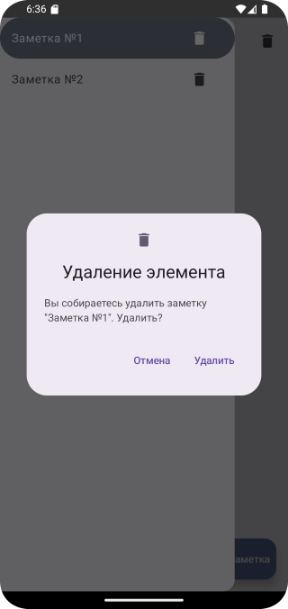

# Домашнее задание по теме "ModalDrawer"

## Приложение “Ежедневник/Заметки”

На основе пройденного материала необходимо написать приложение для написания и просмотра развернутых заметок, с возможностью их удаления. Приложение включает в себя два экрана: первый предназначен для просмотра и удаления заметок, второй - для их написания.

Первый экран включает в себя: `ModalNavigationDrawer`, для просмотра списка написанных заметок и переключения между ними по нажатию на `NavigationDrawerItem`. Каждый `NavigationDrawerItem` должен иметь `IconButton`, по нажатию на который, соответствующая заметка будет удаляться. Каждая заметка состоит из двух элементов: заголовка и основного содержания заметки. Заголовок отображается как на экране, в параметре content у `ModalNavigationDrawer`, так и в каждом `NavigationDrawerItem`. Основное содержание заметки отображается под заголовком в параметре content у `ModalNavigationDrawer`. Так же первое активити должно содержать `FloatingActionBar`, по нажатию на который, пользователя переносит на второе активити.

Второй экран должне включать в себя: два `TextField`/`OutlinedTextField`, один из которых предназначен для написания заголовка заметки, другой - для написания основного содержания заметки; `Button` для сохранения заметки и перехода на первый активити.

Все поля для ввода текста должны проверяться на пустоту, если поля пустые - должен вылетать `Snackbar`, сообщающий о том, что пользователю нужно ввести текст. Количество заметок тоже должно проверяться. Если пользователь попробует удалить единственную заметку, то должен вылетать `Snackbar`, сообщающий о том, чтобы пользователь создал хотя бы еще одну заметку.Содержимое каждого экрана должно иметь возможность вертикальной прокрутки. Рекомпозиция компонентов должна происходить моментально.

## Скриншоты домашнего задания по теме "ModalDrawer"

Скриншоты здесь

# Домашнее задание по теме "AlertDialog"

## Приложение «Заметки v 2.0»

На основе пройденного материала необходимо написать приложение для написания и просмотра заметок, с возможностью их удаления.

Логика создания приложения прежней версии выполняется согласно домашнему заданию `IconIconButtonFloatingActionButton`.

Приложение должно включать в себя:

`Text`, отображающий заголовок приложения;

`LazyColumn`, который будет отображать написанные пользователем заметки;

`TextField`/`OutlinedTextField`, в который пользователь сможет вводить текст заметки;

`FloatingActionButton`, при нажатии на которую, написанный пользователем текст в `TextField`/`OutlinedTextField` будет добавляться в список;

`IconButton` напротив каждой заметки, при нажатии на которую, соответствующая заметка будет удаляться.

Рекомпозиция элементов экрана должна происходить моментально.

При изменении ориентации экрана, состояние компонентов должно сохраняться.

При удалении элемента на экране по нажатию на `IconButton` элемента, на экране появляется Dialog с картинкой, символизирующей удаление, подтверждающим сообщением и двумя TextButton «Отмена» и «Удаление».

## Скриншоты домашнего задания по теме "AlertDialog"

Скриншоты здесь

